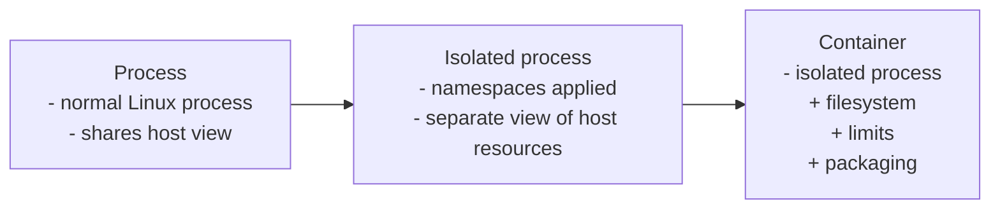

# Part 1: Container Internals 

## Session goal

By the end of this session, you should be able to answer:

> "What actually is a container?"

## The central idea

A container is not a virtual machine.  
It is a regular Linux process with a restricted view of the system, constructed from a small set of kernel primitives.

This session builds that mental model from the ground up.



## cgroups

cgroups control how much of a resource a process may consume.  
Together with namespaces, they form the complete container model.

- **Memory limits** — cap RAM usage, observe OOM behavior via `memory.events`
- **CPU throttling** — apply a quota, observe `cpu.stat` and `nr_throttled`

**Key insight:** every `docker run --memory` and `--cpus` flag is a cgroup write.

## Linux namespaces

Namespaces give a process an isolated view of system resources.  
Each lab demonstrates one namespace type.

- **Prerequisites** — environment check, current namespace links
- **UTS + PID** — private hostname, private process tree
- **Mount** — private mount table, ephemeral tmpfs
- **Network** — private network stack, veth pair between two namespaces
- **Build a container by hand** — combine all four namespaces into one process

**Key insight:** namespaces isolate *visibility*. They do not limit *consumption*.


## Current lab structure

```text
part1/
├── namespaces/
│   ├── 00-prerequisites/
│   ├── 01-uts-pid/
│   ├── 02-mount/
│   ├── 03-network/
│   └── 04-build-a-container-by-hand/
├── cgroups/
│   ├── 01-memlimit/
│   └── 02-cpulimit/
```

## Suggested run order

cgroup labs
1. `01-memlimit`
2. `02-cpulimit`
   
namespaces labs
3. `01-uts-pid/demo.sh`
4. `02-mount/demo.sh`
5. `03-network/demo.sh`
6. `04-build-a-container-by-hand/demo.sh`

## What you will learn

By working through the labs, you should get a clearer understanding of:

- why containers are not virtual machines
- how Linux isolates processes, hostname, mounts, and networking
- how a container can be assembled from kernel features
- how cgroups enforce CPU and memory limits
- why these ideas matter for modern application delivery
- how these concepts connect to Docker and Kubernetes

## Connecting the dots

- what a container runtime adds on top of what we just built
- image layers and overlayfs — concept only
- why containers start fast and VMs do not
- what is still missing before we reach Kubernetes

## What this session does not cover

- OCI image format and container registries
- container networking beyond veth pairs (CNI, bridges, overlays)
